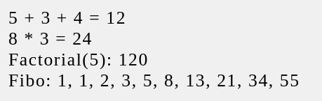

# Reactjs is a turing complete programming language

Note: Uses react canary (19)

Our [App.tsx](./src/App.tsx) here calculates factorial of a number, fibonacci sequence and does a bit of arithmetics but it does all that using react (not JS). What I mean by that is:
- No function recursion
- No loops
- No if-else/`?:` ternaries/`&& ||` ternaries
- No switch-case
- No arithmetic operators

## How it works
It's all a blur now. I was in a state of trance when I wrote this. But basically, it uses Suspense and react's ability to get stuck in infinite render/state-update loop to compute things.

Don't want to spend more time on this so if you need more details, feel free to ask in an issue. I'll be happy to explain.

## How to run it?
Why would you want to do something like that? But if you're sure you want to...

- Clone this thing
- Install dependencies `bun i` (Uses bun because I'm cool like that)
- `bun run dev`
- Open `localhost:5173` in your browser

